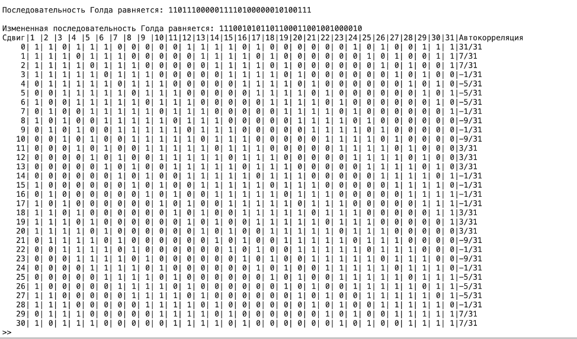
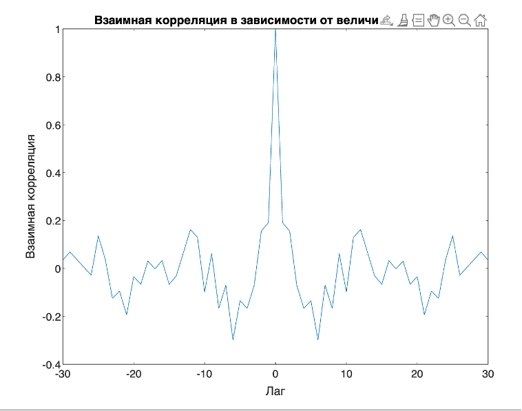
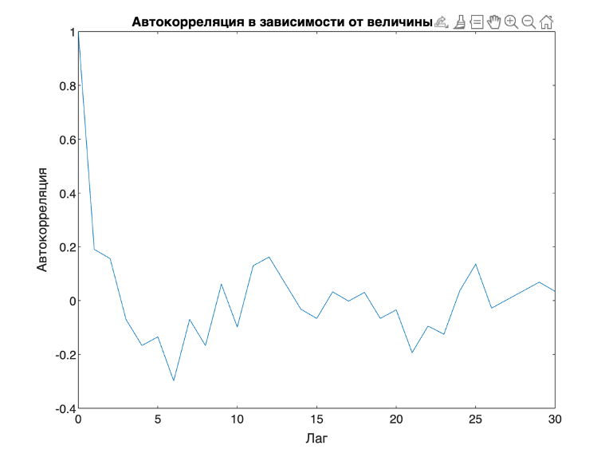

# Задание Второе 
## Проектирование радиопокрытия мобильных сетей.  Модели распространения сигналов. Бюджеты каналов
Цель работы 
Получить представление о том, как проектируется покрытие сетей мобильной связи и, научиться рассчитывать радиус действия (радиопокрытие) отдельных 
базовых станций БС 

  График Зависимости входных потерь радиосигнала от растояния

  
  Результаты вычислений

# Задание Третее 
## Корреляция дискретных сигналов 
Цель Работы 
Получить представление о том, что такое корреляционная функция и нормализованная взаимная корреляционная функция, как они вычисляются и какое отношение 
имеют к процедурам синхронизации в сетях мобильной связи

  
  Результат вывода программы thirdLab.c в терминале
  

  
  Результат вывода массивов a	= [0.3 0.2  -0.1 4.2 -2 1.5 0]; b = [0.3 4 -2.2 1.6 0.1 0.1 0.2] программы thirdLabSecond.py
  

  Результат вывода Графика в котором b сдвинута на индекс максимального значения корреляции и график зависимости взаимной корреляции последовательностей от величины циклического сдвига
  

  Результаты рассчетов корреляции и нормализованной корреляции
  

# Задание Четыре
## Изучение корреляционных свойств последовательностей, используемых для синхронизации в сетях мобильной связи
Цель работы 
Получить представление о том, какие существуют псевдослучайные двоичные последовательности, какими корреляционными свойствами они обладают и как используются для синхронизации приемников и передатчиков в сетях мобильной связи

  Результат вывода программы fourthLab.c в терминале
  

  
  Результат вывода программы fourthLab.m 
  

  Результат вывода Графика Взаимной корреляции от величины сдвигов
  

  Результат вывода Графика Автокорреляции от величины сдвигов
  

# Задание Пять
## Циклический избыточный код. CRC

Цель работы
    Получить представление о том, как осуществляется проверка на наличие ошибок в пакетах с данными в современных системах связи (Error detection) посредством использования циклического избыточного кода CRC (Cyclic Redundancy Check).  

  Результат вывода программы fifthLab.c в терминале
  

    изменяем полином на 6 битный
  

    изменяем в полином 1 бит
    

# Расчетно-графическая работа
## Закрепление знания по «Основам систем мобильной связи»

Цель работы 
    Закрепить и структурировать знания, полученные в рамках изучения дисциплины «Основы систем мобильной связи». 

    Результат вывода всей работы в терминале
  

    Графический вывод первых 5 пунктов
  

    Графический вывод зашумленного сигнала
    

    Графический вывод передаваемого сигнала 
        с различными N 
    

    
    Графический вывод принимаемого сигнала 
        с различными N 
    

